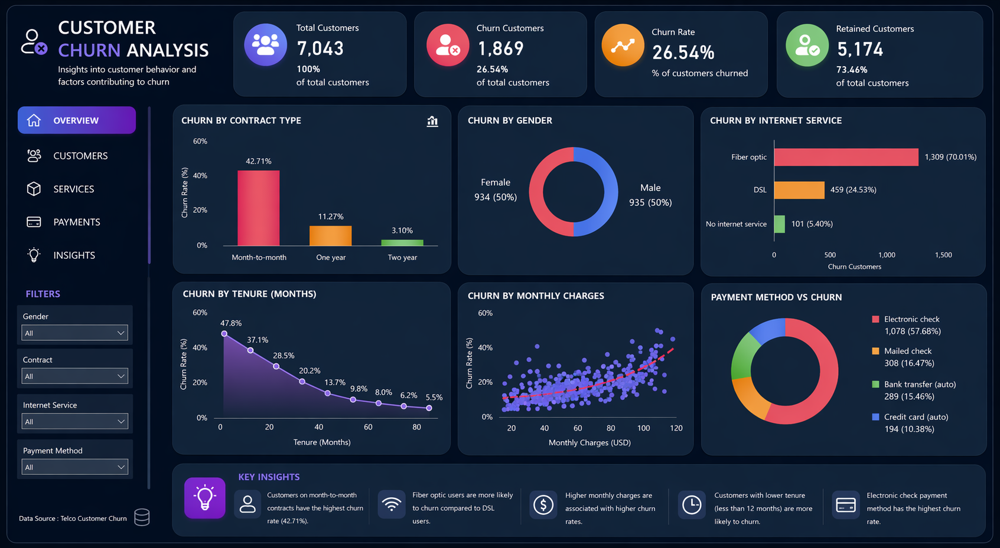

# Customer Churn Analysis

## 📌 Project Overview
This project analyzes customer churn behavior in a telecom company and predicts whether a customer will leave the service.

## 🛠 Tools & Technologies
- Python (Pandas, NumPy)
- Data Visualization (Matplotlib, Seaborn)
- Machine Learning (Scikit-learn)
- Power BI

## 📊 Power BI Dashboard

## 🔍 Key Insights
- Customers with high monthly charges are more likely to churn
- Month-to-month contract customers show highest churn
- Customers with longer tenure are less likely to leave

## 🤖 Models Used
- Logistic Regression
- Random Forest

## 📈 Results
Random Forest performed better with higher accuracy and recall in predicting churn customers.

## 🎯 Business Impact
This project helps businesses identify at-risk customers and take proactive steps to reduce churn.

## 📁 Files in this Repository
- `customer_churn_analysis.ipynb` → Full analysis & ML model
- `dashboard.png` → Power BI dashboard screenshot
